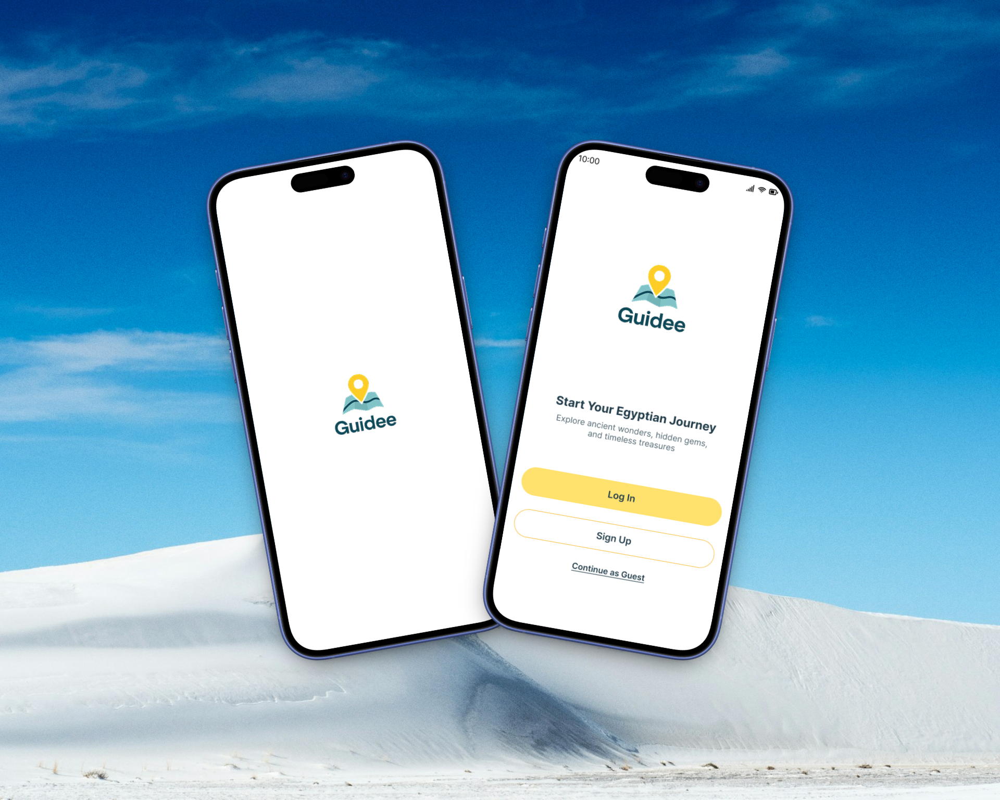
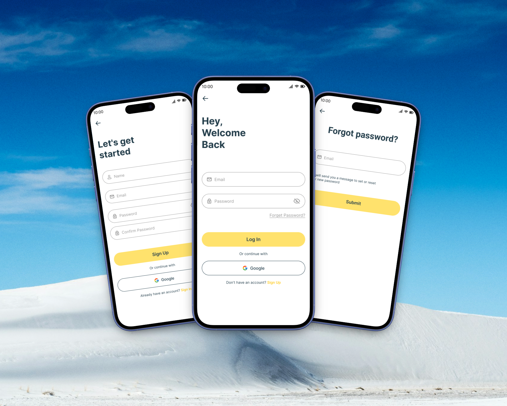
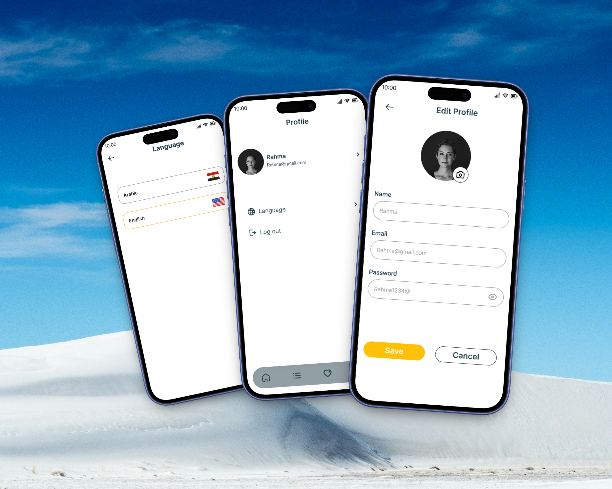

# 🏖️ Guidee - Smart Tour Guide App for Egypt

  
  
  
  
  

---

## 📖 Overview

**Guidee** is an intelligent mobile application designed to revolutionize how tourists and locals explore Egypt's rich cultural heritage. Built with Flutter and powered by Supabase, Guidee provides a seamless offline-first experience that helps users discover, plan, and enjoy tourist attractions across Egypt.

The app leverages location-based services, smart categorization, and personalized recommendations to create an unforgettable travel experience - all while working perfectly even without an internet connection.

---

## 🎓 Project Information

| **Field** | **Details** |
|-----------|-------------|
| **Project Name** | Guidee - Tour Guide App |
| **Program** | Digital Egypt Pioneers Initiative (DEPI) |
| **Project Type** | Graduation Project |
| **Country** | Egypt 🇪🇬 |
| **Category** | Tourism & Travel Technology |

---

## 🎯 Project Objectives

- **Simplify Tourism**: Make exploring Egypt's attractions accessible and organized for everyone
- **Personalized Experience**: Provide location-based recommendations and smart categorization
- **Offline-First Architecture**: Ensure full functionality regardless of internet connectivity
- **Trip Planning**: Enable users to schedule visits with intelligent reminder system
- **Multilingual Support**: Break language barriers with complete Arabic and English interfaces
- **Community Driven**: Share experiences through reviews and ratings

---

## ✨ Core Features

### 🔐 **Authentication System**
- **Email/Password Registration**: Secure account creation with validation
- **Email Verification**: Automated email confirmation for account security
- **Forgot Password**: Password recovery via email with secure reset links
- **Social Login**: Quick access through third-party authentication
- **Guest Mode**: Explore app features without registration (limited functionality)
- **Persistent Sessions**: Stay logged in across app restarts

### 🏠 **Smart Home Screen**
- **Location-Based Discovery**: Automatically detects and displays nearby tourist attractions
- **Intelligent Categorization**: 
  - Historical Sites (Pyramids, Temples, Monuments)
  - Natural Wonders (Beaches, Deserts, Oases)
  - Cultural Attractions (Museums, Markets, Traditional Areas)
  - Religious Sites (Mosques, Churches, Historic Religious Buildings)
- **Top Recommendations**: Showcases highest-rated places based on community reviews
- **Dynamic Content**: Real-time updates of new places and seasonal attractions
- **Quick Search**: Fast filtering by name, category, or location

### 📍 **Place Details & Exploration**
- **Comprehensive Information**: 
  - High-quality image galleries
  - Detailed descriptions and historical context
  - Opening hours and ticket prices
  - Contact information and official websites
- **User Reviews & Ratings**: Community-driven feedback system
- **Interactive Maps**: View exact location with directions
- **Accessibility Information**: Details about facilities and services

### 🗓️ **Visit Planning System**
- **Custom Visit Schedules**: Create personalized itineraries
  - Select specific date and time for each visit
  - Organize multiple visits across different days
- **Smart Notifications**: 
  - Reminder alerts before scheduled visits
  - Weather-based suggestions for outdoor attractions
  - Travel time estimates based on your location
- **Calendar Integration**: View all planned visits in organized calendar view
- **Edit & Manage**: Easily reschedule or cancel planned visits

### ⭐ **Favorites & Collections**
- **Quick Access**: Save places for future visits
- **Custom Collections**: Organize favorites into themed groups
- **Sync Across Devices**: Access your favorites on any device
- **Offline Availability**: Saved places work without internet

### 👤 **User Profile & Settings**
- **Profile Management**: 
  - Update personal information
  - Change profile picture
  - Manage account settings
- **Language Toggle**: Switch between Arabic and English seamlessly

### 🌐 **Offline-First Architecture**
- **Complete Offline Functionality**: 
  - Browse all downloaded places without internet
  - Access saved favorites and planned visits
  - View cached images and descriptions
  - Make changes that sync when connection returns
- **Smart Caching Strategy**: 
  - Automatic download of nearby places
  - Prioritized content based on user preferences
  - Efficient storage management
- **Background Sync**: 
  - Automatic synchronization when online
  - Conflict resolution for offline changes
  - Seamless transition between offline/online modes
- **Data Optimization**: Compressed data transfer for faster loading

### 🔔 **Notification System**
- **Visit Reminders**: Timely alerts for scheduled trips
---

## 🛠️ Technical Architecture

### **Technology Stack**

| **Layer** | **Technology** | **Purpose** |
|-----------|----------------|-------------|
| **Frontend** | Flutter | Cross-platform mobile development |
| **Backend** | Supabase | Authentication, Database, Storage |
| **Local Storage** | Hive | Offline data persistence |
| **State Management** |  Bloc | Efficient state handling |
| **Maps** | Google Maps API | Location services and navigation |
| **Cloud Services** | Google Cloud Platform | Additional cloud resources |
| **Notifications** | Firebase Local Notifications   |

## 📱 App Screenshots

### 🎬 **Onboarding Experience**

  
  
<i>Intuitive onboarding flow introducing app features</i>

### 🎨 **Splash & Welcome**

  
  
<i>Beautiful splash screen and welcoming interface</i>

### 🔑 **Authentication**

  
  
<i>Secure login, registration, and password recovery</i>

### 🏡 **Home & Discovery**

  
  
<i>Location-based recommendations and category browsing</i>

### 📋 **Planning & Favorites**

  
  
<i>Organized visit schedules and favorite collections</i>

### ⚙️ **Settings & Profile**

  
  
<i>Comprehensive settings and profile management</i>

---

## 👥 Development Team

<table align="center">
  <tr>
    <td align="center"><b>Kareem Thabet</b> Mobile Developer</td>
    <td align="center"><b>Lara Mahrous</b> Mobile Developer</td>
    <td align="center"><b>Marina Emad</b> Mobile Developer</td>
  </tr>
  <tr>
    <td align="center"><b>Retaj Ali</b> Mobile Developer</td>
    <td align="center"><b>Aya Farag</b> Mobile Developer</td>
    <td align="center"><b>Mohamed Badr</b> Mobile Developer/td>
  </tr>
</table>

---

## 🏆 About DEPI

This project was developed as the graduation project for the **Digital Egypt Pioneers Initiative (DEPI)** - a transformative national program launched by Egypt's Ministry of Communications and Information Technology.

**Mission**: Empowering Egyptian youth with cutting-edge digital skills and real-world project experience to drive Egypt's digital transformation.

**Our Achievement**: Successfully created a production-ready tourism application showcasing advanced mobile development skills, offline-first architecture, and user-centric design principles.

---

  
<b>Made with ❤️ in Egypt 🇪🇬</b>

  
<i>"Discover Egypt, One Place at a Time"</i>

